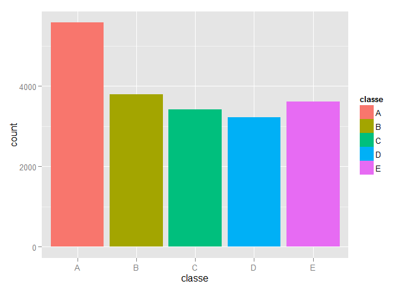

# Practical Machine Learning: Course Project

## Synopsis

In this project, we analyse data from accelerometers on the belt, forearm, arm, and dumbell of 6 participants. They were asked to perform barbell lifts correctly and incorrectly in 5 different ways. Our goal is to apply machine learning algorithm to predict the manner in which they do exercise, i.e. how well (in the 5 classes) they will do it.

More information is available from the website here:  http://groupware.les.inf.puc-rio.br/har

## Data Processing

### Download and import data

First, we check whether the data files are already in the working directory and download the data files if necessary.


```r
# set options 
options(warn=-1);

# install.package("R.utils")
library(R.utils, quietly=TRUE);
```

```
## 
## Attaching package: 'R.oo'
## 
## The following objects are masked from 'package:methods':
## 
##     getClasses, getMethods
## 
## The following objects are masked from 'package:base':
## 
##     attach, detach, gc, load, save
## 
## 
## Attaching package: 'R.utils'
## 
## The following object is masked from 'package:utils':
## 
##     timestamp
## 
## The following objects are masked from 'package:base':
## 
##     cat, commandArgs, getOption, inherits, isOpen, parse, warnings
```

```r
# Download data
if (!file.exists("pml-training.csv")){
      download.file("https://d396qusza40orc.cloudfront.net/predmachlearn/pml-training.csv", "pml-training.csv")
      }

if (!file.exists("pml-testing.csv")){
      download.file("https://d396qusza40orc.cloudfront.net/predmachlearn/pml-testing.csv", "pml-testing.csv")
      }

# Import data 
pml_training <- read.csv(file = 'pml-training.csv',
                         na.strings = c('NA',''))
pml_testing <- read.csv(file = 'pml-testing.csv', 
                        na.strings = c('NA',''))
```

### Preprocess the data

Take an initial look of the data:

```r
dim(pml_training)
```

```
## [1] 19622   160
```

```r
dim(pml_testing)
```

```
## [1]  20 160
```

The training data contains 19622 records of 160 features. The testing data contains 20 sets of data for further evaluation of our developed model.

Test the number of NAs in each features and see whether the feature have sufficient records to be included in the analysis:

```r
na_test1 = sapply(pml_training, function(x) {sum(is.na(x))})
table(na_test1)
```

```
## na_test1
##     0 19216 
##    60   100
```

```r
na_test2 = sapply(pml_testing, function(x) {sum(is.na(x))})
table(na_test2)
```

```
## na_test2
##   0  20 
##  60 100
```

There are 100 features with lots of NAs (> 19000 out of the 19622 records in the training data; and 20 out of the 20 records in the testing data). Remove these features:

```r
# Get the features with lots of NAs
NAs1 = names(na_test1[na_test1>19000])
NAs2 = names(na_test2[na_test2==20])
# Make sure the features are the same 
NAs1 == NAs2
```

```
##   [1] TRUE TRUE TRUE TRUE TRUE TRUE TRUE TRUE TRUE TRUE TRUE TRUE TRUE TRUE
##  [15] TRUE TRUE TRUE TRUE TRUE TRUE TRUE TRUE TRUE TRUE TRUE TRUE TRUE TRUE
##  [29] TRUE TRUE TRUE TRUE TRUE TRUE TRUE TRUE TRUE TRUE TRUE TRUE TRUE TRUE
##  [43] TRUE TRUE TRUE TRUE TRUE TRUE TRUE TRUE TRUE TRUE TRUE TRUE TRUE TRUE
##  [57] TRUE TRUE TRUE TRUE TRUE TRUE TRUE TRUE TRUE TRUE TRUE TRUE TRUE TRUE
##  [71] TRUE TRUE TRUE TRUE TRUE TRUE TRUE TRUE TRUE TRUE TRUE TRUE TRUE TRUE
##  [85] TRUE TRUE TRUE TRUE TRUE TRUE TRUE TRUE TRUE TRUE TRUE TRUE TRUE TRUE
##  [99] TRUE TRUE
```

```r
# Remove those features with lots of NAs
pml_training = pml_training[, !names(pml_training) %in% NAs1]
pml_testing = pml_testing[, !names(pml_testing) %in% NAs2]
```

Take a look of the resulting features:

```r
names(pml_training)
```

```
##  [1] "X"                    "user_name"            "raw_timestamp_part_1"
##  [4] "raw_timestamp_part_2" "cvtd_timestamp"       "new_window"          
##  [7] "num_window"           "roll_belt"            "pitch_belt"          
## [10] "yaw_belt"             "total_accel_belt"     "gyros_belt_x"        
## [13] "gyros_belt_y"         "gyros_belt_z"         "accel_belt_x"        
## [16] "accel_belt_y"         "accel_belt_z"         "magnet_belt_x"       
## [19] "magnet_belt_y"        "magnet_belt_z"        "roll_arm"            
## [22] "pitch_arm"            "yaw_arm"              "total_accel_arm"     
## [25] "gyros_arm_x"          "gyros_arm_y"          "gyros_arm_z"         
## [28] "accel_arm_x"          "accel_arm_y"          "accel_arm_z"         
## [31] "magnet_arm_x"         "magnet_arm_y"         "magnet_arm_z"        
## [34] "roll_dumbbell"        "pitch_dumbbell"       "yaw_dumbbell"        
## [37] "total_accel_dumbbell" "gyros_dumbbell_x"     "gyros_dumbbell_y"    
## [40] "gyros_dumbbell_z"     "accel_dumbbell_x"     "accel_dumbbell_y"    
## [43] "accel_dumbbell_z"     "magnet_dumbbell_x"    "magnet_dumbbell_y"   
## [46] "magnet_dumbbell_z"    "roll_forearm"         "pitch_forearm"       
## [49] "yaw_forearm"          "total_accel_forearm"  "gyros_forearm_x"     
## [52] "gyros_forearm_y"      "gyros_forearm_z"      "accel_forearm_x"     
## [55] "accel_forearm_y"      "accel_forearm_z"      "magnet_forearm_x"    
## [58] "magnet_forearm_y"     "magnet_forearm_z"     "classe"
```

The first seven features are not of our interest - not related to movement, thus can be removed.

```r
pml_training = pml_training[,-c(1:7)]
pml_testing = pml_testing[,-c(1:7)]
dim(pml_training)
```

```
## [1] 19622    53
```

```r
dim(pml_testing)
```

```
## [1] 20 53
```

## Model Development

### Select a model
The variable we will be predicting on is classe:

```r
summary(pml_training$classe)
```

```
##    A    B    C    D    E 
## 5580 3797 3422 3216 3607
```

```r
library(ggplot2, quietly = TRUE)
ggplot(pml_training) + geom_histogram(aes(x = classe, fill= classe))
```

 

The classes are quit well balanced (of the same order of 10^3), a random forest model can be used.

### Build a model
Load the necessay packages:

```r
library(caret, quietly=TRUE);library(e1071, quietly=TRUE);
```

```
## Note: the specification for S3 class "family" in package 'MatrixModels' seems equivalent to one from package 'lme4': not turning on duplicate class definitions for this class.
```

```r
library(randomForest, quietly=TRUE);
```

```
## randomForest 4.6-10
## Type rfNews() to see new features/changes/bug fixes.
```

Partition the training data to training set and testing set:

```r
set.seed(123)
inTrain <- createDataPartition(pml_training$classe, p=0.75, list=FALSE )
training <- pml_training[inTrain,]
testing <- pml_training[-inTrain,]
dim(training)
```

```
## [1] 14718    53
```

```r
dim(testing)
```

```
## [1] 4904   53
```

Fit a random forest model, use doParallel package to run on 4 cores.

```r
# Load packages for parallel computing
library(doParallel, quietly=TRUE);
library(Hmisc, quietly=TRUE);
```

```
## 
## Attaching package: 'survival'
## 
## The following object is masked from 'package:caret':
## 
##     cluster
## 
## 
## Attaching package: 'Hmisc'
## 
## The following object is masked from 'package:randomForest':
## 
##     combine
## 
## The following object is masked from 'package:e1071':
## 
##     impute
## 
## The following object is masked from 'package:R.utils':
## 
##     capitalize
## 
## The following objects are masked from 'package:base':
## 
##     format.pval, round.POSIXt, trunc.POSIXt, units
```

```r
set.seed(123)
# run on 4 cores, 200 trees each
registerDoParallel()
mod_rf <- foreach(ntree=rep(200,4), .combine=randomForest::combine,
                  .packages="randomForest") %dopar% {
                        randomForest(classe ~ ., data = training,
                                     ntree=ntree)
                        }
```

### Model Evaluation
Use the testing set from data partition to evaluate the model developed.


```r
predictions1 <- predict(mod_rf, training)
confusionMatrix(predictions1,training$classe)
```

```
## Confusion Matrix and Statistics
## 
##           Reference
## Prediction    A    B    C    D    E
##          A 4185    0    0    0    0
##          B    0 2848    0    0    0
##          C    0    0 2567    0    0
##          D    0    0    0 2412    0
##          E    0    0    0    0 2706
## 
## Overall Statistics
##                                      
##                Accuracy : 1          
##                  95% CI : (0.9997, 1)
##     No Information Rate : 0.2843     
##     P-Value [Acc > NIR] : < 2.2e-16  
##                                      
##                   Kappa : 1          
##  Mcnemar's Test P-Value : NA         
## 
## Statistics by Class:
## 
##                      Class: A Class: B Class: C Class: D Class: E
## Sensitivity            1.0000   1.0000   1.0000   1.0000   1.0000
## Specificity            1.0000   1.0000   1.0000   1.0000   1.0000
## Pos Pred Value         1.0000   1.0000   1.0000   1.0000   1.0000
## Neg Pred Value         1.0000   1.0000   1.0000   1.0000   1.0000
## Prevalence             0.2843   0.1935   0.1744   0.1639   0.1839
## Detection Rate         0.2843   0.1935   0.1744   0.1639   0.1839
## Detection Prevalence   0.2843   0.1935   0.1744   0.1639   0.1839
## Balanced Accuracy      1.0000   1.0000   1.0000   1.0000   1.0000
```

```r
predictions2 <- predict(mod_rf, testing)
confusionMatrix(predictions2,testing$classe)
```

```
## Confusion Matrix and Statistics
## 
##           Reference
## Prediction    A    B    C    D    E
##          A 1394    1    0    0    0
##          B    1  946    8    0    0
##          C    0    2  847    9    0
##          D    0    0    0  793    1
##          E    0    0    0    2  900
## 
## Overall Statistics
##                                           
##                Accuracy : 0.9951          
##                  95% CI : (0.9927, 0.9969)
##     No Information Rate : 0.2845          
##     P-Value [Acc > NIR] : < 2.2e-16       
##                                           
##                   Kappa : 0.9938          
##  Mcnemar's Test P-Value : NA              
## 
## Statistics by Class:
## 
##                      Class: A Class: B Class: C Class: D Class: E
## Sensitivity            0.9993   0.9968   0.9906   0.9863   0.9989
## Specificity            0.9997   0.9977   0.9973   0.9998   0.9995
## Pos Pred Value         0.9993   0.9906   0.9872   0.9987   0.9978
## Neg Pred Value         0.9997   0.9992   0.9980   0.9973   0.9998
## Prevalence             0.2845   0.1935   0.1743   0.1639   0.1837
## Detection Rate         0.2843   0.1929   0.1727   0.1617   0.1835
## Detection Prevalence   0.2845   0.1947   0.1750   0.1619   0.1839
## Balanced Accuracy      0.9995   0.9973   0.9940   0.9930   0.9992
```

The prediction accuracy on the test data set (99.5%) is greater than 99%. The out of sample error is less than 1% (1- testing accuracy = 0.5%). The model developed performs very well.

## Further Prediction and Submission
Get the prediction for the testing cases:


```r
ptest <- predict(mod_rf, pml_testing)

ptest
```

```
##  1  2  3  4  5  6  7  8  9 10 11 12 13 14 15 16 17 18 19 20 
##  B  A  B  A  A  E  D  B  A  A  B  C  B  A  E  E  A  B  B  B 
## Levels: A B C D E
```

Write text files for submission:

```r
pml_write_files = function(x){
  n = length(x)
  for(i in 1:n){
    filename = paste0("problem_id_",i,".txt")
    write.table(x[i],file=filename,quote=FALSE,row.names=FALSE,col.names=FALSE)
  }
}

pml_write_files(ptest)
```

## Conclusions
A model is developed to predict how well the participants will do exercise based on their movement data. The out of sample error is estimated to be 0.5%, which is very promising. 


Last Modified: 27 Sep 2015

