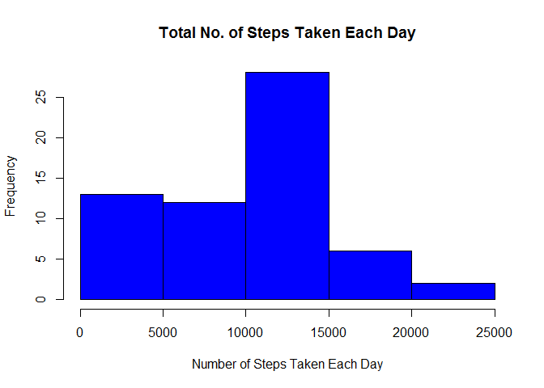
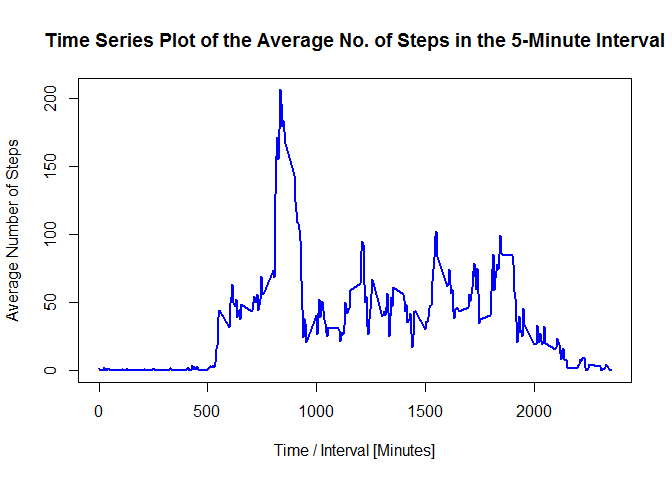
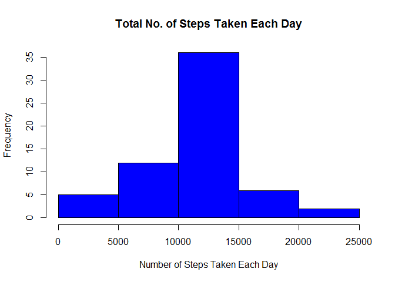
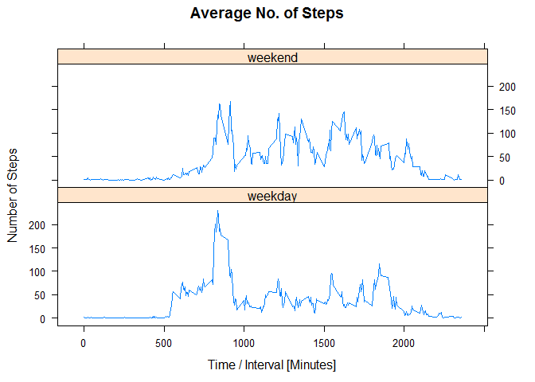

# Reproducible Research: Peer Assessment 1


## Loading and preprocessing the data

### Download, unzip and import the data as data frame "data":


```r
if(!file.exists("activity.csv")){
      temp <- tempfile()
      datafile <- "https://d396qusza40orc.cloudfront.net/repdata%2Fdata%2Factivity.zip"
      download.file(datafile, temp) 
      unzip(temp)
      unlink(temp)
}

data <- read.csv("activity.csv")
```

Show the first few rows of the data


```r
head(data)
```

```
##   steps       date interval
## 1    NA 2012-10-01        0
## 2    NA 2012-10-01        5
## 3    NA 2012-10-01       10
## 4    NA 2012-10-01       15
## 5    NA 2012-10-01       20
## 6    NA 2012-10-01       25
```

### Process/transform the data into a format suitable for further analysis

Transform the date attribute to time stamp


```r
data$date <- as.POSIXct(data$date, format = "%Y-%m-%d")
```

Show the first few rows of the data


```r
head(data)
```

```
##   steps       date interval
## 1    NA 2012-10-01        0
## 2    NA 2012-10-01        5
## 3    NA 2012-10-01       10
## 4    NA 2012-10-01       15
## 5    NA 2012-10-01       20
## 6    NA 2012-10-01       25
```

## What is mean total number of steps taken per day?

For this part of the assignment, the missing values in the dataset is ignored.

### Calculate the total number of steps taken per day

```r
data_steps_by_day <- aggregate(data$steps, list(data$date), sum, na.rm=TRUE)
names(data_steps_by_day) <- c("date", "steps")
head(data_steps_by_day)
```

```
##         date steps
## 1 2012-10-01     0
## 2 2012-10-02   126
## 3 2012-10-03 11352
## 4 2012-10-04 12116
## 5 2012-10-05 13294
## 6 2012-10-06 15420
```

### Make a histogram of the total number of steps taken each day

```r
hist(data_steps_by_day$steps, main = "Total No. of Steps Taken Each Day",
     col = "blue", xlab = "Number of Steps Taken Each Day")
```

 

### Calculate and report the mean and median of the total number of steps taken per day

The mean of the total number of steps taken per day:

```r
mean(data_steps_by_day$steps)
```

```
## [1] 9354.23
```
The median of the total number of steps taken per day:

```r
median(data_steps_by_day$steps)
```

```
## [1] 10395
```

## What is the average daily activity pattern?


### Make a time series plot (i.e. type = "l") of the 5-minute interval (x-axis) and the average number of steps taken, averaged across all days (y-axis)

Calculate the average number of steps taken for each interval:

```r
mean_data <- aggregate(data$steps, list(data$interval), mean, na.rm = TRUE)
names(mean_data) <- c("interval", "mean_steps")
head(mean_data)
```

```
##   interval mean_steps
## 1        0  1.7169811
## 2        5  0.3396226
## 3       10  0.1320755
## 4       15  0.1509434
## 5       20  0.0754717
## 6       25  2.0943396
```

Make a time series plot:

```r
plot(mean_data$interval, mean_data$mean_steps, type = "l", col = "blue",
     lwd = 2, main = "Time Series Plot of the Average No. of Steps in the 5-Minute Interval",
     xlab = "Time / Interval [Minutes]", ylab = "Average Number of Steps")
```

 

### Which 5-minute interval, on average across all the days in the dataset, contains the maximum number of steps?
Maximum number of steps:

```r
max(mean_data$mean_steps)
```

```
## [1] 206.1698
```
The corresponding 5-minute interval:

```r
mean_data$interval[mean_data$mean_steps == max(mean_data$mean_steps)]
```

```
## [1] 835
```

## Imputing missing values


Note that there are a number of days/intervals where there are missing values (coded as NA). The presence of missing days may introduce bias into some calculations or summaries of the data.

### Calculate and report the total number of missing values in the dataset (i.e. the total number of rows with NAs)


```r
sum(is.na(data$steps))
```

```
## [1] 2304
```
### Fill in all of the missing values in the dataset using the mean for that 5-minute interval

Merge the original data frame "data" with "mean_data"

```r
data_new <- merge(x=data, y=mean_data, by="interval", all.x = TRUE)
```

Find the index of NA in steps in the data frame

```r
Ind_NA <- which(is.na(data_new$steps))
```

Replace the NA in steps by mean_steps

```r
data_new[Ind_NA, "steps"] <- data_new[Ind_NA,"mean_steps"]
```


### Create a new dataset that is equal to the original dataset but with the missing data filled in.

Re-order the new data frame to preserve data and interval ordering


```r
data_new <- data_new[order(data_new$date,data_new$interval),]
head(data_new)
```

```
##     interval     steps       date mean_steps
## 1          0 1.7169811 2012-10-01  1.7169811
## 63         5 0.3396226 2012-10-01  0.3396226
## 128       10 0.1320755 2012-10-01  0.1320755
## 205       15 0.1509434 2012-10-01  0.1509434
## 264       20 0.0754717 2012-10-01  0.0754717
## 327       25 2.0943396 2012-10-01  2.0943396
```

Keep only the columns as in the original data


```r
data_new <- subset(data_new, select = c("steps","date","interval"))

head(data_new)
```

```
##         steps       date interval
## 1   1.7169811 2012-10-01        0
## 63  0.3396226 2012-10-01        5
## 128 0.1320755 2012-10-01       10
## 205 0.1509434 2012-10-01       15
## 264 0.0754717 2012-10-01       20
## 327 2.0943396 2012-10-01       25
```

### Make a histogram of the total number of steps taken each day and Calculate and report the mean and median total number of steps taken per day. Do these values differ from the estimates from the first part of the assignment? What is the impact of imputing missing data on the estimates of the total daily number of steps?

Calculate the total number of steps taken per day

```r
data_new_steps_by_day <- aggregate(data_new$steps, list(data_new$date), sum, 
                                   na.rm=TRUE)
names(data_new_steps_by_day) <- c("date", "steps")
head(data_new_steps_by_day)
```

```
##         date    steps
## 1 2012-10-01 10766.19
## 2 2012-10-02   126.00
## 3 2012-10-03 11352.00
## 4 2012-10-04 12116.00
## 5 2012-10-05 13294.00
## 6 2012-10-06 15420.00
```

Make a histogram of the total number of steps taken each day

```r
hist(data_new_steps_by_day$steps, main = "Total No. of Steps Taken Each Day",
     col = "blue", xlab = "Number of Steps Taken Each Day")
```

 

Calculate and report the mean and median of the total number of steps taken per day

The mean of the total number of steps taken per day:

```r
mean(data_new_steps_by_day$steps)
```

```
## [1] 10766.19
```
The median of the total number of steps taken per day:

```r
median(data_new_steps_by_day$steps)
```

```
## [1] 10766.19
```

The mean and median are different from the first part of the assignment where the NAs are removed. Both the mean and median increase when the missing data are filled by the average number of steps in that interval. 

## Are there differences in activity patterns between weekdays and weekends?

For this part, the dataset with the filled-in missing values is used.

### Create a new factor variable in the dataset with two levels - "weekday" and "weekend" indicating whether a given date is a weekday or weekend day.

Create a column weekday


```r
data_new$weekday <- weekdays(data_new$date)
head(data_new)
```

```
##         steps       date interval weekday
## 1   1.7169811 2012-10-01        0  Monday
## 63  0.3396226 2012-10-01        5  Monday
## 128 0.1320755 2012-10-01       10  Monday
## 205 0.1509434 2012-10-01       15  Monday
## 264 0.0754717 2012-10-01       20  Monday
## 327 2.0943396 2012-10-01       25  Monday
```

Create a column for weekend flag


```r
data_new$Flag <- ifelse(data_new$weekday == "Saturday"| data_new$weekday == "Sunday", "weekend","weekday")
data_new$Flag <- as.factor(data_new$Flag)
head(data_new)
```

```
##         steps       date interval weekday    Flag
## 1   1.7169811 2012-10-01        0  Monday weekday
## 63  0.3396226 2012-10-01        5  Monday weekday
## 128 0.1320755 2012-10-01       10  Monday weekday
## 205 0.1509434 2012-10-01       15  Monday weekday
## 264 0.0754717 2012-10-01       20  Monday weekday
## 327 2.0943396 2012-10-01       25  Monday weekday
```

### Make a panel plot containing a time series plot (i.e. type = "l") of the 5-minute interval (x-axis) and the average number of steps taken, averaged across all weekday days or weekend days (y-axis).

Compute the average number of steps taken, averaged across all day types


```r
mean_data_new <- aggregate(steps ~ interval + Flag, data_new, mean)

head(mean_data_new)
```

```
##   interval    Flag      steps
## 1        0 weekday 2.25115304
## 2        5 weekday 0.44528302
## 3       10 weekday 0.17316562
## 4       15 weekday 0.19790356
## 5       20 weekday 0.09895178
## 6       25 weekday 1.59035639
```

Make a panel of time series plots

```r
library(lattice)
xyplot(steps ~ interval | Flag, mean_data_new, type = "l", layout = c(1,2), 
       xlab = "Time / Interval [Minutes]", ylab = "Number of Steps", 
       main = "Average No. of Steps")
```

 

The activity patterns between weekdays and weekends are not quite the same. The onset of activity is earlier during weekdays (about 0500 vs 0800 during weekends). There are less activities during office hour (0800 ~ 1700) during weekdays. For weekends, activities are spread out throughout the day. 

